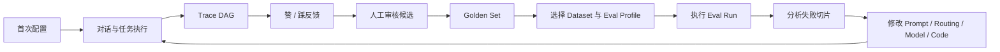
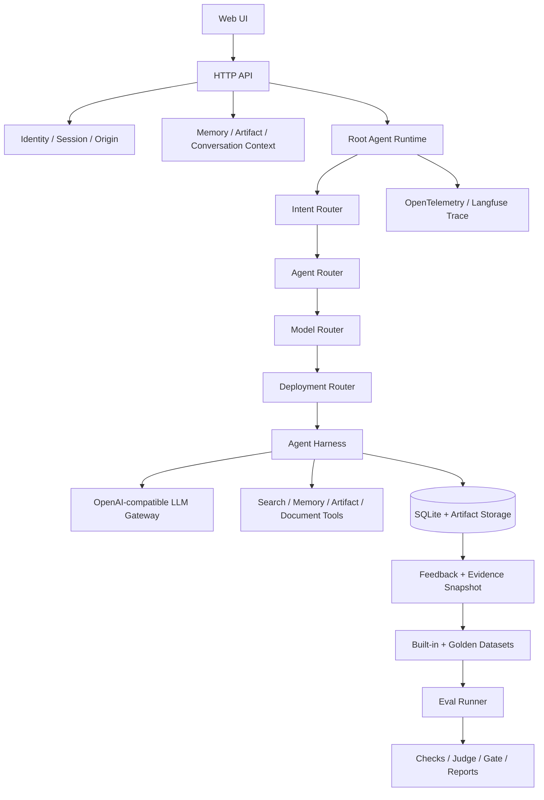
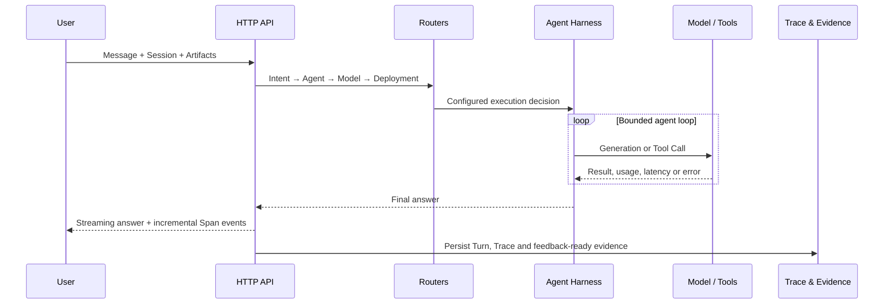

# Personal AI Agent from Scratch

> 一套面向学习、研究和工程实践的 Eval-driven Personal AI Agent 参考架构：从身份、会话、记忆、工具和多层路由，到 Trace、Dataset、Evaluator、Eval Run 与持续迭代。

[](https://nodejs.org/)
[](LICENSE)
[](evals/README.md)
[](test/)

`Personal AI Agent from Scratch` 不是又一个只展示聊天结果的 Demo。它用一个规模适中的真实应用，完整展示 Personal AI Agent 应具备的主要模块、模块之间的边界，以及如何把每次运行转化为可观察、可评估、可持续改进的工程证据。

仓库名称强调学习和参考架构；内置 Web 应用在界面中使用 `Personal Copilot` 作为示例产品名称。所有核心模块都使用供应商中立的技术概念，可以替换模型网关、搜索服务、观测后端和具体 Agent。

## 项目背景

很多 Agent 教程止步于“Prompt + Model + Tool”：它们可以完成一次演示，却没有回答以下工程问题：

- 用户、Session、长期记忆和文件如何隔离？
- Intent routing、Agent routing、Model routing 与 Deployment routing 如何解耦？
- Agent 如何在预算、重复调用、超时和无进展保护下执行工具？
- 如何从 Trace 中解释模型为什么这样路由、调用了什么工具、哪里慢或哪里失败？
- 用户的赞踩如何形成受治理的 Golden Set，而不是直接污染训练或评测真值？
- Prompt、模型、路由或代码发生变化后，如何用 Dataset、Evaluator 和 Eval Run 判断是否真的变好？

本项目把这些问题放在一套可运行的 Node.js 应用中回答。目标不是提供一个包办所有场景的 Agent Framework，而是提供一份可以阅读、运行、修改、观察和回归的工程蓝图。

## 你可以从中学到什么

| 主题 | 项目中的对应实现 |
|---|---|
| Agent Runtime | Root Agent、Specialist Agent、Harness Loop、Tool 执行预算与终止保护 |
| Intention Layer | Intent、Agent、Model、Deployment 四层独立路由与版本化配置 |
| Personalization | Session History、跨 Session 长期记忆、用户级数据隔离与生命周期 |
| Multimodal | 图像、PDF、文本、表格和音频上传，以及模型模态能力检查 |
| Observability | 一轮一个 Trace、Session 聚合、多层 Span DAG、Generation/Tool/Agent 语义 |
| Evaluation | 版本化 Dataset、确定性检查、Strict JSON LLM-as-a-Judge、基线和发布门禁 |
| Continuous Learning | 赞踩反馈、不可变证据快照、人工审核、Golden Set、Eval Run 与回归闭环 |
| Production Boundaries | 身份、Origin、幂等、限流、Secret 隔离、SQLite 迁移和安全错误协议 |

## 产品架构

产品围绕一个可见、可治理的改进闭环组织，而不是把 Eval 隐藏在离线脚本里。



Web UI 提供四个主要工作区：

| 工作区 | 主要用途 |
|---|---|
| Chat | 与 Agent 对话、上传文件、选择模型，并查看当前 Session 历史 |
| Trace Inspector | 实时查看 Intent、Agent、Model、Deployment、Generation、Tool 与 Memory Span |
| Memory | 搜索、新建、编辑、停用、设置有效期或删除长期记忆 |
| Eval Datasets / Eval Runs | 审核用户反馈、维护 Golden Set、选择测试数据并管理 Eval 生命周期 |

产品坚持三个原则：

1. **运行证据不等于质量真值。** Trace 说明发生了什么，人工审核后的 Golden Set 才说明应该发生什么。
2. **反馈不直接修改系统。** 赞踩先进入候选池，补充期望行为并审核后才参与回归。
3. **Dataset 与 Eval Run 分离。** Dataset 定义可复用测试输入；Eval Run 冻结一次执行的 Profile、范围、结果、Gate 和重跑血缘。

## 技术架构



### 四层路由

| 层 | 只负责回答 | 主要输出 |
|---|---|---|
| Intent routing | 这是什么任务，有何风险、约束和能力需求？ | Domain、Task Type、Risk、Required Capabilities |
| Agent routing | 应直接回答、继续执行，还是委派给哪个 Agent？ | Mode、Agent ID、Policy Evidence |
| Model routing | 当前角色和任务应该使用哪个逻辑模型与参数？ | Model Alias、Candidate Ranking、Temperature、Token Budget |
| Deployment routing | 逻辑工作负载应发送到哪个实际端点？ | Endpoint、Physical Model、Credential Reference |

四层分别配置、分别产生 Trace Span，模型供应商、物理模型和凭证只存在于 Deployment 边界。默认 `Auto` 是应用侧 Model Router 的选择模式，不是一个上游模型 ID。

### 一轮请求的执行链路



### 关键模块

| 路径 | 职责 |
|---|---|
| `config/` | 产品、Workflow、Model Catalog 与四层路由配置 |
| `routing/` | 四个相互独立、供应商中立的 Router |
| `agents/` | Agent Registry、Prompt 和可达关系 |
| `capabilities/` | Tool Schema、参数校验与执行器 |
| `agent-runtime.mjs` | 单轮编排、上下文装配、Trace 与事务边界 |
| `harness-controller.mjs` | Tool Loop、重复检测、预算与停止条件 |
| `memory-*.mjs` | 长期记忆策略、检索和生命周期 |
| `observability.mjs` | Trace、Span、Generation、Agent 与 Tool 观测语义 |
| `evals/` | Dataset、Evaluator、Profile、基线、校准、对比与报告 |
| `eval-run-*.mjs` | Web Eval Run 状态机、真实 Runner、结果和重跑血缘 |
| `docs/` | 产品、技术、Eval、工程规约与架构决策 |

## 主要功能

- 本地用户名登录，以及 Session、Memory、Artifact、Feedback、Golden Set 和 Eval Run 的用户级隔离。
- 首次配置向导：配置 LLM Gateway、Intention Model、LLM-as-a-Judge、Tavily-compatible Search 和 Langfuse。
- Root Agent 与六类 Specialist Agent，可配置 Prompt、能力和路由白名单。
- 服务端 Model Catalog 提供 `Auto` 与 15 个显式回答模型；前端不维护模型常量副本。
- 应用侧 Model Router：模态硬过滤、Policy 排序、成功率、EWMA 延迟、熔断和可选探索。
- 多模态输入：PNG、JPEG、WebP、PDF、TXT、Markdown、JSON、CSV、MP3 与 WAV。
- 长期记忆管理：自动捕获、跨 Session 检索、冲突取代、有效期、总开关和删除。
- 实时 Trace DAG：新增 Span 增量追加，不刷新页面；历史 Trace 自动折叠。
- 用户反馈闭环：Turn 级赞踩、目标 Trace 与 Session 前缀快照、人工审核和 Golden Set。
- Eval Dataset 工作台：内置基准、用户反馈候选、有效/归档 Gold、筛选、详情和 JSONL 导出。
- Eval Run 工作台：Draft、启动、取消、结果聚合、失败信号、脱敏日志、重跑、归档和恢复。
- PDF、DOCX Artifact 生成与下载。
- SQLite 前向迁移、Request ID 幂等、Origin 校验、限流和结构化安全错误。

## 安装与启动

### 环境要求

- Node.js `24` 或更高版本
- npm
- 一个 OpenAI-compatible LLM Gateway API Key
- 可选：Tavily-compatible Search API Key
- 可选：Langfuse Cloud 或自托管 Langfuse 项目

项目不提供 Dockerfile，方便直接阅读和调试真实运行路径。

### 1. 获取代码

```bash
git clone https://github.com/InfronAI/personal-ai-agent-from-scratch.git
cd personal-ai-agent-from-scratch
npm install
```

### 2. 准备本地配置

```bash
cp .env.example .env
```

可以直接启动后通过首次配置向导填写凭证，也可以先编辑 `.env`。最小模型配置为：

```dotenv
LLM_GATEWAY_API_KEY=replace-with-your-key
LLM_GATEWAY_BASE_URL=https://your-openai-compatible-gateway.example/v1
LLM_GATEWAY_INTENTION_MODEL=google/gemini-3.1-flash-lite
COPILOT_EVAL_JUDGE_MODEL=openai/gpt-4o
```

可选搜索与 Trace 配置：

```dotenv
WEB_SEARCH_API_KEY=replace-with-your-search-key
WEB_SEARCH_BASE_URL=https://your-tavily-compatible-search.example/v1/tavily

LANGFUSE_BASE_URL=https://cloud.langfuse.com
LANGFUSE_PUBLIC_KEY=pk-lf-example
LANGFUSE_SECRET_KEY=sk-lf-example
LANGFUSE_TRACING_ENVIRONMENT=development
```

`.env`、`.data/`、本地 SQLite、Artifact、运行日志和真实凭证均被 Git 忽略。浏览器不会读取或持久化服务端密钥。

### 3. 启动应用

```bash
npm start
```

访问 [http://127.0.0.1:9093/](http://127.0.0.1:9093/)，输入一个用户名即可进入独立本地空间。

本地用户名模式没有密码，只用于单机学习和开发。生产环境应切换到 `trusted-header`，由受信任身份代理注入用户信息，并关闭 Web 凭证配置。

## 功能使用指南

### 1. 完成首次配置

首次登录会打开 `Complete core configuration`：

1. 填写模型网关 Base URL 与 API Key。
2. 确认 Intention Layer 模型和 LLM-as-a-Judge 模型。
3. 按需配置 Search 与 Langfuse。
4. 运行最小真实 Completion 验证；只有成功后才完成初始化。

已录入的非敏感配置会在页面中展示，密钥只显示是否存在，不回显明文。Langfuse Processor 在进程启动前初始化，因此修改其配置后需要重启。

### 2. 对话并观察 Agent 执行

1. 点击 `New chat` 创建新的 Session。
2. 保持 `Auto`，让 Model Router 选择模型；或显式选择一个回答模型。
3. 输入问题或上传文件。
4. 在右侧查看完整 Agent DAG 和 Span 详情，包括路由、Prompt、Completion、Tool Call、Tool Result、Model、Token、Latency 与错误。

一轮对话对应一个 Trace，多轮对话通过 Session 归组。Generation、Tool 与 Agent 使用不同 Observation 类型并保持真实父子关系。

### 3. 管理长期记忆

打开左侧 `Memory`：

- 搜索或按类型筛选记忆。
- 手工新增、编辑、停用或删除。
- 设置 30、90、365 或 730 天有效期。
- 关闭长期记忆总开关。

自动记忆只保存用户明确提供、可跨任务复用且非敏感的信息；疑问、一次性任务和凭证不会被写入。

### 4. 把反馈沉淀为 Golden Set

1. 在回答下点击赞或踩。
2. 打开 `Eval Datasets` 的 Review inbox。
3. 查看目标 Turn、完整 Trace 和截止该 Turn 的 Session 证据。
4. 补充期望答案、期望路由或 Failure Code。
5. 批准后进入 Golden Set；拒绝后从候选队列移除，但保留审计记录。

赞踩本身只是反馈信号，只有 `human-reviewed + approved` 的条目才是回归真值。

### 5. 创建和执行 Eval Run

打开 `Eval Runs`：

1. 新建 Draft，填写 Run Name。
2. 选择 Eval Profile 与一个或多个 Dataset。
3. 启动执行并查看实时状态。
4. 检查 Gate、Suite 聚合、失败信号和脱敏日志。
5. 可以基于相同范围重跑；新 Run 会保留父子血缘，不覆盖历史结果。

## Eval 体系

当前内置：

- `18` 个版本化 Dataset
- `140` 个 Eval Case
- `80` 个原创 Case，适配 `27` 个主流 Domain Benchmark 的能力定义与评分思想
- `69` 个不依赖离线 Fixture、允许真实调用的 Case
- 通用知识、垂直场景、性能韧性、安全合规、Agent 能力、长期记忆、多语言、检索、医疗、金融、网络安全、软件和数据工程等切片

### Eval Profile

| Profile | 用途 | 是否调用真实服务 |
|---|---|---|
| `local` | 本地确定性全量回归 | 否 |
| `ci` | 发布门禁、覆盖率与诊断债务 Ratchet | 否 |
| `live` | 在 live-eligible Case 上执行真实 Agent 工作流 | 是 |
| `live-traced` | 真实执行并导出完整 Trace | 是 |
| `live-judged` | 真实执行、Trace 与 Strict JSON LLM-as-a-Judge | 是 |

### 常用命令

```bash
# 语法、文档、Schema、109 项测试和 140 Case CI Eval
npm run verify

# 本地确定性 Eval
npm run eval

# 真实 Agent Eval；会产生模型或搜索费用
npm run eval:live -- --confirm-live
npm run eval:live:traced -- --confirm-live
npm run eval:live:judged -- --confirm-live

# 候选结果与当前基线比较
npm run eval:compare -- --candidate evals/results/<candidate>.json

# 导出人工审核的 Feedback Golden Set
npm run eval:golden:export
```

确定性契约优先使用代码检查；只有需要理解语义的质量判断才使用 LLM-as-a-Judge。Judge 必须输出 Strict JSON，并应使用人工标签持续校准。

## 配置事实源

| 配置 | 文件 |
|---|---|
| 产品身份与范围 | `config/product.config.json` |
| Workflow 阶段 | `config/workflow.config.json` |
| 四层路由与 Deployment | `config/routing.config.json` |
| 可选回答模型与能力 | `config/model-catalog.config.json` |
| Agent、Prompt 与路由白名单 | `agents/registry.json` |
| Tool Schema 与执行协议 | `capabilities/registry.mjs` |
| Dataset、Evaluator、Profile 与 Gate | `evals/eval.config.json` |
| 架构决策 | `docs/DECISIONS.md` |

修改行为时，应先修改配置和失败模式，再补充正反 Eval，最后修改实现代码。

## 安全边界

- 提交前运行 `npm run security:check`；检查器只报告文件、行号和凭证类型，不输出疑似密钥内容。
- `.env` 和 `.data/` 永远不应进入 Git；`.env.example` 只能保留占位符。
- API Key 只允许存在于服务端环境、权限为 `0600` 的本地运行配置或生产 Secret Manager。
- Trace、日志、HTTP 响应、浏览器存储、Dataset 和 Eval Report 不得包含凭证明文或附件 Base64 正文。
- 本地用户名登录不是生产认证；生产部署必须使用可信身份代理、HTTPS、Secret Manager 和持久化存储。
- 真实 Eval 必须显式传入 `--confirm-live`，避免意外产生外部调用和费用。

## 已知边界

- 当前一轮最多委派一个 Specialist Agent，不实现无限制多 Agent 自主协作。
- SQLite 适用于单实例学习与开发；多副本部署需要共享事务数据库。
- 上传入口尚不等同于完整内容安全网关，生产环境仍需恶意文件扫描与对象存储治理。
- 内置离线 Eval 验证工程契约，不代表真实业务满意度；需要用目标用户 Trace 和人工标签持续扩充 Golden Set。
- Model Router 的在线证据当前以单进程状态起步，生产环境应进一步持久化质量、成本和可靠性特征。

## 文档

- [文档中心](docs/README.md)
- [产品与范围](docs/PRODUCT.md)
- [技术设计](docs/TECHNICAL_DESIGN.md)
- [系统化 Eval](docs/EVALUATION.md)
- [工程规约](docs/ENGINEERING.md)
- [架构决策](docs/DECISIONS.md)
- [Eval 命令与数据说明](evals/README.md)

## 参与贡献

提交变更前请阅读 [AGENTS.md](AGENTS.md)，并运行：

```bash
npm run security:check
npm run verify
```

路由、Prompt、模型或 Deployment 变化还需要生成候选结果并执行 `npm run eval:compare`。新功能应同时提供可观察证据、正例、反例和明确的回归判定。

## License

[MIT](LICENSE) © 2026 InfronAI
