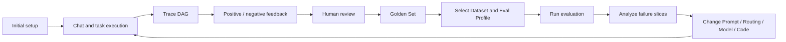
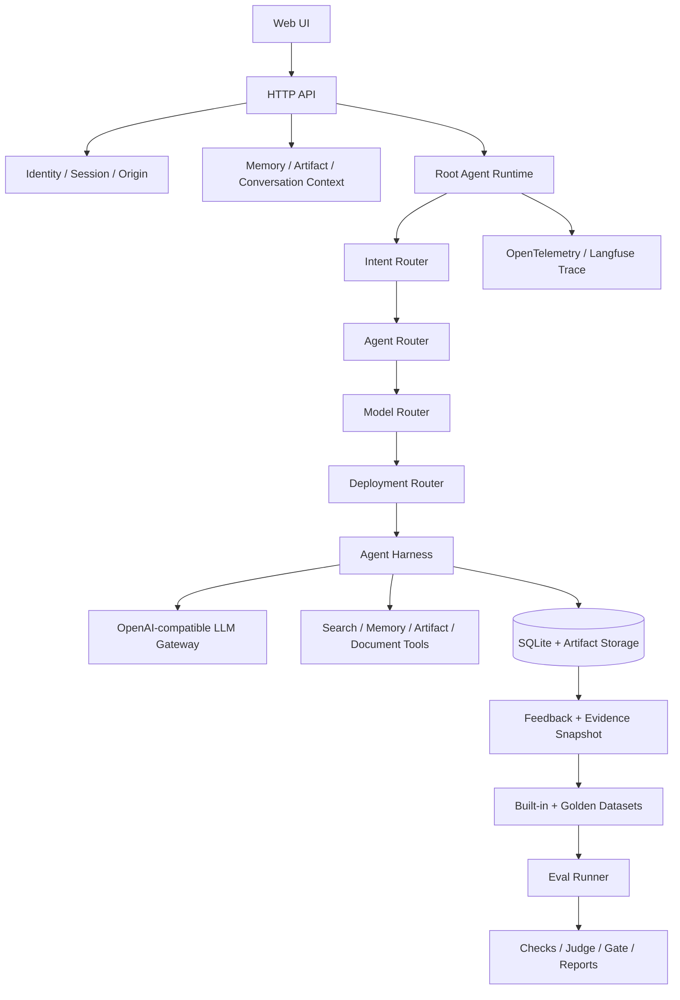

<p align="center">
  <a href="README.md"></a>
  <a href="README.zh-CN.md"></a>
</p>

# Personal AI Agent from Scratch

> An eval-driven reference architecture for learning, researching, and building personal AI agents—from identity, sessions, memory, tools, and layered routing to traces, datasets, evaluators, eval runs, and continuous improvement.

[](https://nodejs.org/)
[](LICENSE)
[](evals/README.md)
[](test/)

`Personal AI Agent from Scratch` is more than a chat demo. It uses a compact but complete application to show the major modules a personal AI agent needs, the boundaries between them, and how to turn every run into observable, evaluable evidence for continuous improvement.

The repository name emphasizes learning and reference architecture. The bundled Web application uses `Personal Copilot` as its sample product name. Core modules use vendor-neutral concepts, so you can replace the model gateway, search service, observability backend, and individual agents.

## Why this project exists

Many agent tutorials stop at “Prompt + Model + Tool.” They may support a demo, but they leave important engineering questions unanswered:

- How should users, sessions, long-term memory, and files be isolated?
- How can Intent routing, Agent routing, Model routing, and Deployment routing remain independent?
- How should an agent execute tools under budgets, repetition detection, timeouts, and no-progress guards?
- How can a trace explain why a model was selected, which tools ran, and where latency or errors occurred?
- How can user feedback become a governed Golden Set instead of directly contaminating evaluation truth?
- After changing a prompt, model, route, or implementation, how can Dataset, Evaluator, and Eval Run evidence prove that the system improved?

This project answers those questions in a runnable Node.js application. It is not intended to be an all-purpose agent framework. It is an engineering blueprint you can read, run, modify, observe, and regress.

## What you can learn

| Area | Implementation in this project |
|---|---|
| Agent Runtime | Root Agent, Specialist Agents, Harness Loop, tool budgets, and termination guards |
| Intention Layer | Independently configured and versioned Intent, Agent, Model, and Deployment routing |
| Personalization | Session history, cross-session long-term memory, user-level isolation, and lifecycle controls |
| Multimodal | Image, PDF, text, spreadsheet, and audio uploads with model modality checks |
| Observability | One Trace per turn, Session aggregation, layered Span DAGs, and Generation/Tool/Agent semantics |
| Evaluation | Versioned Datasets, deterministic checks, Strict JSON LLM-as-a-Judge, baselines, and release gates |
| Continuous Learning | Feedback, immutable evidence snapshots, human review, Golden Sets, Eval Runs, and regression loops |
| Production Boundaries | Identity, Origin, idempotency, rate limits, secret isolation, SQLite migrations, and safe error contracts |

## Product architecture

The product is organized around a visible, governable improvement loop instead of hiding evaluation in offline scripts.



The Web UI provides four primary workspaces:

| Workspace | Purpose |
|---|---|
| Chat | Talk to the agent, upload files, select a model, and inspect the current Session history |
| Trace Inspector | Inspect Intent, Agent, Model, Deployment, Generation, Tool, and Memory Spans in real time |
| Memory | Search, create, edit, disable, expire, or delete long-term memories |
| Eval Datasets / Eval Runs | Review feedback, manage Golden Sets, select test data, and manage the evaluation lifecycle |

The product follows three principles:

1. **Runtime evidence is not quality truth.** A Trace explains what happened; a human-reviewed Golden Set defines what should happen.
2. **Feedback does not directly change the system.** Positive and negative votes enter a candidate pool and only affect regressions after expected behavior is added and reviewed.
3. **Datasets and Eval Runs are separate.** A Dataset defines reusable test inputs; an Eval Run freezes one execution's Profile, scope, results, gates, and rerun lineage.

## Technical architecture



### Four routing layers

| Layer | The single question it answers | Primary output |
|---|---|---|
| Intent routing | What task is this, and what risks, constraints, and capabilities apply? | Domain, Task Type, Risk, Required Capabilities |
| Agent routing | Should the system answer directly, continue, or delegate to which Agent? | Mode, Agent ID, Policy Evidence |
| Model routing | Which logical model and parameters fit this role and task? | Model Alias, Candidate Ranking, Temperature, Token Budget |
| Deployment routing | Which physical endpoint should execute the logical workload? | Endpoint, Physical Model, Credential Reference |

Each layer is configured independently and emits its own Trace Span. Model providers, physical model identifiers, and credentials exist only at the Deployment boundary. The default `Auto` option invokes the application-side Model Router; it is not an upstream model ID.

### Request execution flow


### Key modules

| Path | Responsibility |
|---|---|
| `config/` | Product, Workflow, Model Catalog, and four-layer routing configuration |
| `routing/` | Four independent, vendor-neutral routers |
| `agents/` | Agent Registry, prompts, and reachability rules |
| `capabilities/` | Tool schemas, argument validation, and executors |
| `agent-runtime.mjs` | Turn orchestration, context assembly, Trace, and transaction boundaries |
| `harness-controller.mjs` | Tool Loop, repetition detection, budgets, and stop conditions |
| `memory-*.mjs` | Long-term memory policy, retrieval, and lifecycle |
| `observability.mjs` | Trace, Span, Generation, Agent, and Tool observability semantics |
| `evals/` | Datasets, Evaluators, Profiles, baselines, calibration, comparison, and reports |
| `eval-run-*.mjs` | Web Eval Run state machine, real runner, results, and rerun lineage |
| `docs/` | Product, technical, evaluation, engineering, and architectural decision documentation |

## Main features

- Local username login with user-level isolation for Sessions, Memory, Artifacts, Feedback, Golden Sets, and Eval Runs.
- First-run setup for the LLM Gateway, Intention Model, LLM-as-a-Judge, Tavily-compatible Search, and Langfuse.
- A Root Agent and six Specialist Agent categories with configurable prompts, capabilities, and routing allowlists.
- A server-owned Model Catalog with `Auto` and 15 explicit answer models; the frontend does not maintain a duplicate list of model constants.
- An application-side Model Router with modality hard filters, policy ranking, success rates, EWMA latency, circuit breaking, and optional exploration.
- Multimodal input for PNG, JPEG, WebP, PDF, TXT, Markdown, JSON, CSV, MP3, and WAV.
- Long-term memory with automatic capture, cross-session retrieval, conflict supersession, expiration, a global switch, and deletion.
- A real-time Trace DAG where new Spans append incrementally without refreshing the page and historical Traces collapse automatically.
- A feedback loop with turn-level voting, target Trace and Session-prefix snapshots, human review, and Golden Sets.
- An Eval Dataset workbench for built-in benchmarks, feedback candidates, active and archived Gold items, filters, detail views, and JSONL export.
- An Eval Run workbench for drafts, execution, cancellation, aggregate results, failure signals, redacted logs, reruns, archiving, and restoration.
- PDF and DOCX Artifact generation and download.
- Forward-only SQLite migrations, Request ID idempotency, Origin validation, rate limits, and structured safe errors.

## Installation and startup

### Requirements

- Node.js `24` or newer
- npm
- An API key for an OpenAI-compatible LLM Gateway
- Optional: an API key for a Tavily-compatible Search service
- Optional: a Langfuse Cloud or self-hosted Langfuse project

The project intentionally does not include a Dockerfile, keeping the real runtime path easy to read and debug.

### 1. Clone the repository

```bash
git clone https://github.com/InfronAI/personal-ai-agent-from-scratch.git
cd personal-ai-agent-from-scratch
npm install
```

### 2. Prepare local configuration

```bash
cp .env.example .env
```

You can start the application and enter credentials through the first-run setup, or edit `.env` first. The minimum model configuration is:

```dotenv
LLM_GATEWAY_API_KEY=replace-with-your-key
LLM_GATEWAY_BASE_URL=https://your-openai-compatible-gateway.example/v1
LLM_GATEWAY_INTENTION_MODEL=google/gemini-3.1-flash-lite
COPILOT_EVAL_JUDGE_MODEL=openai/gpt-4o
```

Optional Search and Trace configuration:

```dotenv
WEB_SEARCH_API_KEY=replace-with-your-search-key
WEB_SEARCH_BASE_URL=https://your-tavily-compatible-search.example/v1/tavily

LANGFUSE_BASE_URL=https://cloud.langfuse.com
LANGFUSE_PUBLIC_KEY=pk-lf-example
LANGFUSE_SECRET_KEY=sk-lf-example
LANGFUSE_TRACING_ENVIRONMENT=development
```

Git ignores `.env`, `.data/`, local SQLite databases, Artifacts, runtime logs, and real credentials. The browser never reads or persists server-side secrets.

### 3. Start the application

```bash
npm start
```

Open [http://127.0.0.1:9093/](http://127.0.0.1:9093/) and enter a username to create an isolated local workspace.

The local username mode has no password and is intended only for single-machine learning and development. Production deployments should use `trusted-header`, inject identity through a trusted identity proxy, and disable Web-based credential configuration.

## Usage guide

### 1. Complete the first-run setup

The first login opens `Complete core configuration`:

1. Enter the model gateway Base URL and API Key.
2. Confirm the Intention Layer and LLM-as-a-Judge models.
3. Configure Search and Langfuse if needed.
4. Run a minimal real Completion check; initialization completes only after the check succeeds.

The page shows saved non-sensitive settings. Secrets are represented only by presence and are never displayed in plaintext. The Langfuse Processor initializes before the process starts, so restart the application after changing its configuration.

### 2. Chat and inspect agent execution

1. Select `New chat` to create a new Session.
2. Keep `Auto` to let the Model Router choose, or explicitly select an answer model.
3. Enter a request or upload files.
4. Inspect the full Agent DAG and Span details on the right, including routing, Prompt, Completion, Tool Call, Tool Result, Model, Tokens, Latency, and errors.

One conversation turn maps to one Trace, while a Session groups multiple turns. Generation, Tool, and Agent use distinct Observation types and preserve their real parent-child relationships.

### 3. Manage long-term memory

Open `Memory` in the left navigation to:

- Search memories or filter them by type.
- Create, edit, disable, or delete entries.
- Set retention to 30, 90, 365, or 730 days.
- Disable long-term memory globally.

Automatic memory only stores non-sensitive information that the user explicitly provided and that remains reusable across tasks. Questions, one-off requests, and credentials are not stored.

### 4. Turn feedback into a Golden Set

1. Select positive or negative feedback beneath an answer.
2. Open the Review inbox under `Eval Datasets`.
3. Inspect the target Turn, full Trace, and Session evidence up to that Turn.
4. Add the expected answer, expected route, or Failure Code.
5. Approve the item to add it to the Golden Set. Rejecting removes it from the candidate queue while preserving its audit record.

A vote is only a feedback signal. An item becomes regression truth only after it is `human-reviewed + approved`.

### 5. Create and execute an Eval Run

Open `Eval Runs`:

1. Create a Draft and enter a Run Name.
2. Select an Eval Profile and one or more Datasets.
3. Start the run and monitor its live state.
4. Review gates, Suite aggregates, failure signals, and redacted logs.
5. Rerun the same scope when needed. A rerun preserves parent-child lineage and never overwrites historical results.

## Evaluation system

The built-in evaluation suite currently contains:

- `18` versioned Datasets
- `140` Eval Cases
- `80` original Cases adapted from the capability definitions and scoring ideas of `27` mainstream domain benchmarks
- `69` live-eligible Cases that do not depend on offline fixtures
- Slices covering general knowledge, vertical capabilities, performance and resilience, safety and compliance, agent capabilities, long-term memory, multilingual instructions, retrieval, medicine, finance, cybersecurity, software engineering, and data engineering

### Eval Profiles

| Profile | Purpose | Calls real services? |
|---|---|---|
| `local` | Full deterministic local regression | No |
| `ci` | Release gates, coverage, and diagnostic-debt ratchets | No |
| `live` | Execute real agent workflows on live-eligible Cases | Yes |
| `live-traced` | Execute real workflows and export complete Traces | Yes |
| `live-judged` | Real execution, Traces, and Strict JSON LLM-as-a-Judge | Yes |

### Common commands

```bash
# Syntax, docs, schemas, 109 tests, and the 140-case CI Eval
npm run verify

# Deterministic local Eval
npm run eval

# Real Agent Eval; these commands can incur model or search charges
npm run eval:live -- --confirm-live
npm run eval:live:traced -- --confirm-live
npm run eval:live:judged -- --confirm-live

# Compare a candidate result with the current baseline
npm run eval:compare -- --candidate evals/results/<candidate>.json

# Export the human-reviewed feedback Golden Set
npm run eval:golden:export
```

Deterministic contracts use code checks whenever possible. LLM-as-a-Judge is reserved for quality decisions that require semantic understanding. Judges must return Strict JSON and should be continuously calibrated against human labels.

## Configuration sources of truth

| Configuration | File |
|---|---|
| Product identity and scope | `config/product.config.json` |
| Workflow stages | `config/workflow.config.json` |
| Four-layer routing and Deployment | `config/routing.config.json` |
| Available answer models and capabilities | `config/model-catalog.config.json` |
| Agents, prompts, and routing allowlists | `agents/registry.json` |
| Tool schemas and execution contracts | `capabilities/registry.mjs` |
| Datasets, Evaluators, Profiles, and gates | `evals/eval.config.json` |
| Architectural decisions | `docs/DECISIONS.md` |

When changing behavior, update the configuration and failure modes first, add positive and negative Eval coverage, and then change the implementation.

## Security boundaries

- Run `npm run security:check` before committing. The scanner reports only the file, line number, and credential type; it never prints suspected secret values.
- Never commit `.env` or `.data/`. Keep placeholders only in `.env.example`.
- API keys may exist only in server-side environment variables, local runtime settings with `0600` permissions, or a production Secret Manager.
- Traces, logs, HTTP responses, browser storage, Datasets, and Eval Reports must never include plaintext credentials or attachment Base64 bodies.
- Local username login is not production authentication. Production deployments require a trusted identity proxy, HTTPS, a Secret Manager, and durable storage.
- Real evaluations require the explicit `--confirm-live` flag to prevent accidental external calls and charges.

## Known limitations

- A turn currently delegates to at most one Specialist Agent; it does not implement unconstrained autonomous multi-agent collaboration.
- SQLite is suitable for single-instance learning and development. Multi-replica deployments require a shared transactional database.
- The upload endpoint is not a complete content-security gateway; production environments still need malware scanning and governed object storage.
- Built-in offline Evals verify engineering contracts, not real-world user satisfaction. Continue expanding the Golden Set with target-user Traces and human labels.
- The Model Router begins with single-process online evidence. Production deployments should persist quality, cost, and reliability features.

## Documentation

- [Documentation index](docs/README.md)
- [Product and scope](docs/PRODUCT.md)
- [Technical design](docs/TECHNICAL_DESIGN.md)
- [Systematic evaluation](docs/EVALUATION.md)
- [Engineering guide](docs/ENGINEERING.md)
- [Architectural decisions](docs/DECISIONS.md)
- [Eval commands and data](evals/README.md)

The detailed documentation is currently maintained in Chinese; stable technical identifiers and protocols remain in English.

## Contributing

Read [AGENTS.md](AGENTS.md) before submitting a change, then run:

```bash
npm run security:check
npm run verify
```

Changes to routing, prompts, models, or Deployment also require a candidate result and `npm run eval:compare`. New features should include observable evidence, positive cases, negative cases, and an explicit regression decision.

## License

[MIT](LICENSE) © 2026 InfronAI
