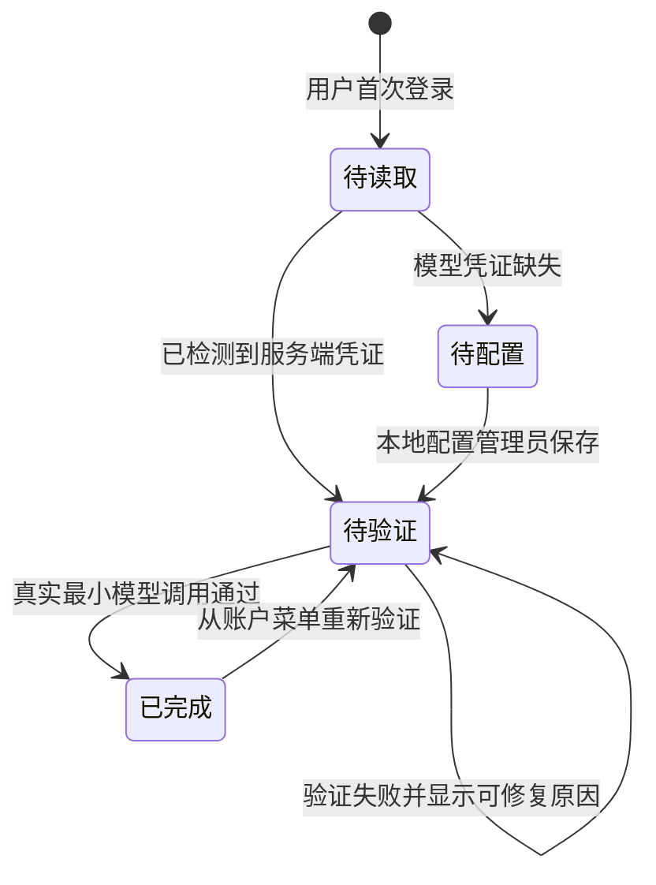

# Personal Copilot 产品与范围

## 1. 产品定位

Personal Copilot from Scratch 是一套供应商中立的参考应用，用来回答三个问题：一个个人助理如何可靠地理解请求、如何把任务交给合适的执行单元、以及如何用真实反馈持续改进。

它不是只展示聊天结果的外壳。每轮对话同时生成可观察的路由、模型、部署、Agent、工具、记忆与质量证据，用户可以从 Web UI 直接看到完整 Trace DAG，并把满意或不满意的回答沉淀成后续回归数据。

## 2. 客户价值

| 角色 | 核心问题 | 产品提供的证据 |
|---|---|---|
| 最终用户 | 回答是否有用、会话是否连续、个人信息是否被正确隔离 | Session、长期记忆、赞踩与可删除数据 |
| 产品经理 | 哪些任务有效，哪些失败模式最值得优化 | Intent、Agent、反馈、Failure Code 与 Golden 切片 |
| Agent 工程师 | Prompt、工具、Harness 或工作流哪里出错 | 完整 Trace DAG、父子关系、参数、结果和预算状态 |
| 模型工程师 | 什么任务该用什么模型与参数 | 逻辑 Model Policy、实际 Deployment、质量/延迟/Token 对比 |
| 平台工程师 | 如何切换端点而不污染产品逻辑 | 独立 Deployment Profile、凭证引用与 Provider 适配层 |
| 数据科学团队 | 如何获得可信且可复现的评测数据 | 版本化 Dataset、人工审核 Golden Set、Judge 校准与基线 |

## 3. 核心产品循环

这条循环遵循“反馈是信号、审核后才是真值”的原则。点赞或点踩绑定具体回答 Turn，同时冻结目标 Trace 与截止该 Turn 的 Session 上下文；这份运行证据用于解释路由、模型、工具和多轮状态，但不会替代人工标签。点赞可确认当前答案；点踩必须补充期望行为或 Failure Code 后才能批准。任何重新评分都会让旧 Gold 失效。

## 4. 当前体验

- 输入用户名后进入单独的本地用户空间。
- 新建对话立即分配新的 Session ID；首次请求进入服务端后持久化 Session，成功完成后写入 Turn。服务端历史在首次加载后立即出现在左侧，浏览器缓存失败不影响展示。
- 左侧会话行提供删除入口；已有 Turn 和尚无 Turn 的服务端 Session 均可删除。删除只对 Owner 生效，并清理本地 Turn、反馈候选与 Gold，长期记忆和外部 Langfuse Trace 保持独立。
- 对话过程中，右侧 Trace 以增量方式追加 Span；历史 Trace 自动折叠。
- Trace 显示 Intent、Agent、Model、Deployment、Generation、Tool、Memory 与最终输出。
- 回答下方提供赞、踩和复制按钮。
- Web UI 固定产品文案使用英文；用户输入、模型输出、记忆、文件名和历史业务数据按原文展示。
- 左侧“记忆”入口提供长期记忆总开关、搜索、类型筛选、新建、编辑、有效期和删除。
- 输入框可直接上传图像、PDF、文本、表格和音频，也可选择用户空间内已有的 Artifact。
- 模型选择器由服务端目录驱动，包含 `Auto` 与 15 个显式回答模型；默认由应用 Model Router 按任务、风险、Agent、模态和实时运行证据选择具体模型。
- Intention Layer 与回答模型解耦：用户切换模型只改变最终回答或 Specialist，不改变意图识别底座。
- 每个用户首次进入时都会看到核心配置向导；完成后可从账户菜单的“核心配置”再次打开。
- 左侧一级 `Eval Datasets` 工作台提供内置 Dataset 目录、反馈审核、有效 Gold、可恢复归档和 JSONL 导出，并可按需展开时间点 Trace 与 Session 证据。
- 左侧一级 `Eval Runs` 工作台管理测试执行生命周期：保存 Draft、选择版本化 Dataset 与 Profile、启动或取消、查看聚合结果与失败信号、基于原范围重跑，以及无损归档和恢复。
- 生成的 PDF、DOCX 作为用户拥有的 Artifact 保存和下载。

## 5. 首次配置体验

- LLM Gateway 是唯一必填能力；验证使用当前 Intention 模型发起最多 8 Token 的真实 Completion。
- 向导先展示当前实例的非敏感配置，再允许修改；LLM-as-a-Judge 独立显示当前生效模型、系统预设和覆盖来源，不与回答模型选择器或 Intention 模型合并。
- Search 独立配置 Tavily-compatible Base URL 与 API Key；密钥只写入服务端且不回显。它可以与模型网关使用相同的实际凭证值，但不会在配置协议中隐式复用；首次向导不主动产生搜索费用。
- Langfuse 插桩随进程默认加载；向导允许填写成对项目密钥、Environment 和可修改 Base URL，默认使用官方 `https://cloud.langfuse.com`。Processor 必须在业务模块前初始化，因此保存新配置后需要重启。
- 配置是实例级的，不属于某个会话。开发环境中首个成功保存者成为配置管理员，其他用户只能查看状态并完成自己的验证。
- 用户可以暂时关闭弹窗，但未完成状态会在下次登录继续出现；完成状态按用户和向导版本保存在 SQLite。
- API Key 不回显、不进入浏览器持久化、会话或 Trace。本地 Web 配置写入 Git 忽略的 `0600` 文件；生产环境使用部署 Secret。

## 6. 模型、记忆与附件

### 6.1 回答模型目录

模型选择器以 `config/model-catalog.config.json` 为唯一事实源。当前包含 `Auto` 与 15 个显式回答模型：

| 供应方 | 模型 | 可接收模态 |
|---|---|---|
| 应用选择模式 | `Auto` | 从支持本轮输入的 Policy 候选中动态选择，不直接调用模型 |
| Google | Gemini 3.1 Flash Lite、Gemini 3.1 Pro Preview | 文本、图像、文件、音频、视频 |
| OpenAI | GPT-5.4 Mini、GPT-5.4、GPT-5.5 | 文本、图像、文件 |
| Anthropic | Claude Sonnet 4.6、Claude Opus 4.8 | 文本、图像、文件 |
| DeepSeek | DeepSeek V4 Flash、DeepSeek V4 Pro | 文本 |
| Qwen | Qwen 3.6 Plus | 文本、图像、视频 |
| Qwen | Qwen3 Coder Next | 文本 |
| Moonshot AI | Kimi K2.6 | 文本、图像 |
| MiniMax | MiniMax M3 | 文本、图像、视频 |
| Z.ai | GLM 5.2 | 文本 |
| xAI | Grok 4.3 | 文本、图像 |

`Auto` 不是模型 ID，也没有 Deployment 映射。它触发本地 Model Router：先按 Deployment 和输入模态过滤，再将 Policy 优先级、运行成功率与 EWMA 延迟加权排名，连续失败模型在冷却期内熔断。网关只在具体模型确定后处理 provider fallback。

表中的模态是应用允许提交给该逻辑模型的输入契约，不代表每个底层 Deployment 在所有环境中都已完成能力验证。修改目录时必须同步 Deployment Alias 与模型路由 Eval。

### 6.2 长期记忆

| 类型 | 保存内容 | 默认有效期 |
|---|---|---:|
| 长期偏好 `preference` | 稳定的表达、格式、语言或交互偏好 | 365 天 |
| 用户资料 `profile` | 用户明确给出的、后续任务可复用的资料 | 730 天 |
| 长期约束 `constraint` | 持续适用的限制条件和工作规则 | 365 天 |
| 明确记忆 `explicit_memory` | 用户明确要求“记住”的非敏感事实 | 365 天 |

用户可以关闭长期记忆，也可以对单条记忆选择 30、90、365 或 730 天有效期。关闭后不再检索或自动捕获长期记忆，但 Session History 仍用于当前会话连续性。长期记忆属于用户空间而非单个 Session；姓名、用户画像和回答偏好支持中英文语义查询。疑问句不会被当作用户事实写入，历史错误覆盖会在读取时安全回退且保留审计证据。

### 6.3 多模态附件

| 输入 | 支持格式 | 模型请求形式 |
|---|---|---|
| 图像 | PNG、JPEG、WebP | `image_url` |
| 文档 | PDF | `file` |
| 文本与数据 | TXT、Markdown、JSON、CSV | 文本内容块 |
| 音频 | MP3、WAV | `input_audio` |

默认单文件不超过 20 MiB，单轮附件总量不超过 30 MiB，最多选择 10 个。上传文件按用户隔离保存；会话列表和应用 Runtime Trace 只保留文件元数据，不保存 Base64。

## 7. 能力范围

当前 Root Agent 可直接回答，也可委派给以下注册 Agent：

| Agent ID | 主要任务 |
|---|---|
| `research_assistant` | 需要实时、外部来源或事实核验的研究 |
| `teaching_assistant` | 概念解释与教学 |
| `medical_assistant` | 一般健康信息与就医提醒 |
| `software_development_assistant` | 软件设计、实现与调试 |
| `analyst` | 结构化分析、比较和决策支持 |
| `document_generator_assistant` | PDF 与 DOCX 文档生成 |

当前能力包括 `TavilySearchTool`、`load_memory`、`load_artifacts`、`generate_pdf`、`generate_docx` 和编排器内部的 `transfer_to_agent`。

## 8. 产品边界

- 当前一轮最多委派一个 Agent，不提供无限制多 Agent 自主协作。
- 本地用户名登录是 MVP 身份入口，不等同于生产认证。
- Web 核心配置仅适合受信任的单机开发环境；生产默认由部署环境管理，不能把本地配置管理员当作组织权限系统。
- 长期记忆采用保守写入策略，不自动把全部对话总结为用户事实。
- 当前上传类型限定为 PDF、PNG、JPEG、WebP、TXT、Markdown、JSON、CSV、MP3 与 WAV；单轮总附件大小受服务端配置约束。
- 用户显式选择的模型必须支持本轮附件模态，否则请求在调用模型前明确失败；`Auto` 由应用 Model Router 在配置候选内选择兼容模型。
- 赞踩只生成候选，不自动改变 Prompt、路由或模型。
- 候选被人工拒绝后立即从待审列表消失；拒绝结论仅保留为审计事实，不进入 Golden Set。
- 默认离线 Eval 证明工程契约可重复，不代表真实用户满意度或事实正确率。
- Eval Run 不提供破坏性删除；归档用于整理历史，重跑始终创建带血缘的新记录，避免丢失发布与回归证据。
- Provider、物理模型和端点属于 Deployment 配置，不属于产品身份。
- 项目不封装 Dockerfile；生产部署由运行环境负责进程、持久卷和身份代理。

## 9. 成功指标

产品指标必须按任务、风险、Agent、模型和 Deployment 切片观察：

- 用户反馈覆盖率、赞率和点踩 Failure Code 分布。
- 候选审核周期、Golden Set 规模、版本与回归通过率。
- Eval Run 完成率、Gate 通过率、执行失败率、取消率、平均运行时长与重跑后的切片变化。
- Intent 与 Agent 路由准确率。
- 任务成功率、事实性、相关性、工具成功率和格式遵循率。
- E2E、TTFT、模型耗时、工具耗时、Token 和错误率。
- Session 串线、跨用户读取、重复副作用和敏感记忆写入必须为零。

任何单一总分都不能替代切片门禁。
