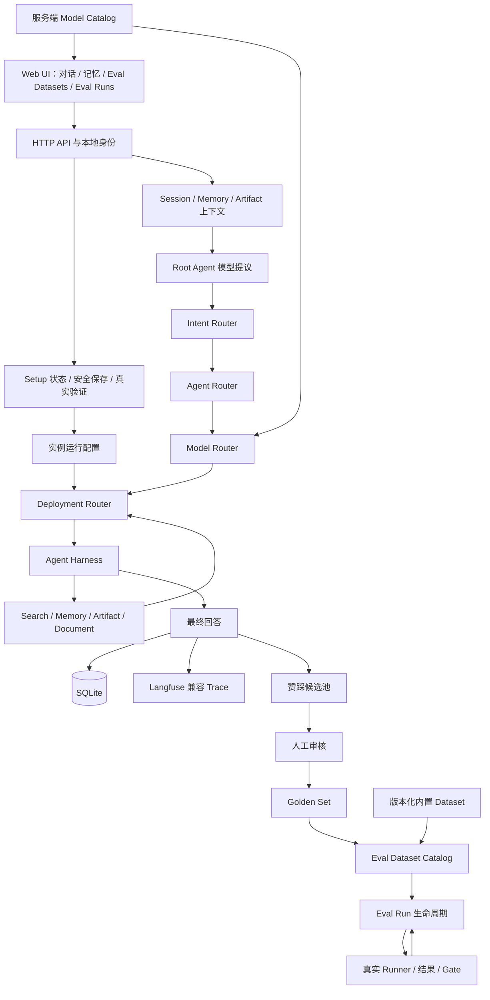
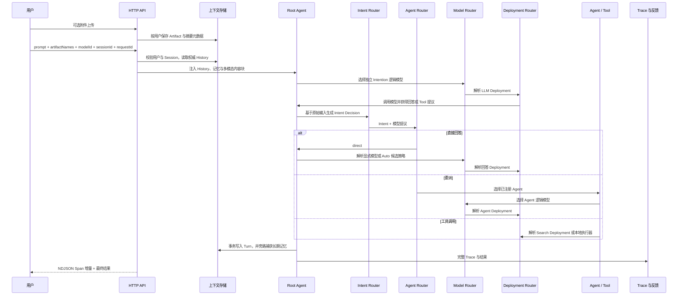
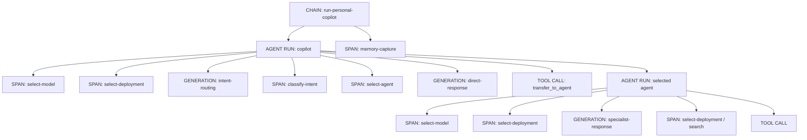
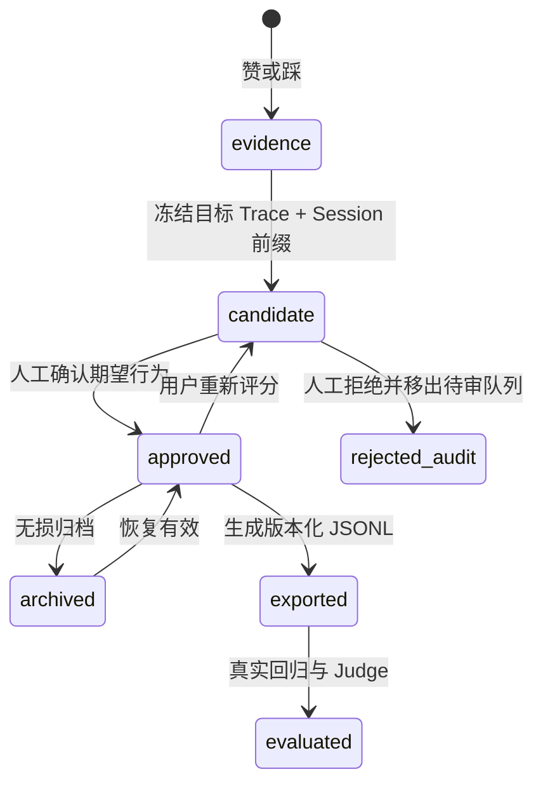

# Personal Copilot 技术设计

## 1. 设计目标

系统必须同时满足可配置、可观察、可评估、可隔离和可替换：路由与 Agent 不固化在前端或编排代码中；一次请求的所有决策可以由 Trace 解释；用户反馈能形成受治理的回归数据；模型、搜索和观测供应商可以在 Deployment 层替换。

## 2. 总体架构



### 2.1 控制面与数据面

控制面由 `config/`、`agents/registry.json`、`capabilities/registry.mjs` 和 `evals/eval.config.json` 构成，定义“应该怎样运行”。其中 `config/model-catalog.config.json` 定义 `selection-mode`、可公开的 `answer-model` 和内部 `control-model` 的逻辑 ID、模态和用途，Schema 为 `schemas/model-catalog.schema.json`；物理模型映射仍只属于 Deployment。数据面由 `server.mjs`、`agent-runtime.mjs`、`routing/`、执行器和 Store 构成，负责“实际运行”。二者通过带版本的配置对象连接，前端只消费服务端目录、结果与 Trace，不维护模型常量副本。

## 3. 四层路由

| 层 | 只回答的问题 | 输入 | 输出 | 配置位置 | Trace 角色 |
|---|---|---|---|---|---|
| Intent routing | 这是什么任务，有何风险、约束和能力需求 | 当前用户输入 | `domain`、`taskType`、`risk`、`constraints`、`requiredCapabilities` | `config/routing.config.json.intentRouting` | `intent-routing-decision` |
| Agent routing | 直接回答、继续工具循环，还是交给哪个 Agent | Intent 与模型提议 | `mode`、`agentId`、策略动作与原因 | `config/routing.config.json.agentRouting`、`agents/registry.json` | `agent-routing` |
| Model routing | 这个角色、风险和输入能力应使用什么逻辑模型与参数 | 角色、Intent、Agent ID、输入模态、用户选择模式 | 具体 `modelAlias`、候选证据、温度、Token 上限、Policy ID | `config/routing.config.json.modelRouting`、`config/model-catalog.config.json` | `model-routing` |
| Deployment routing | 逻辑模型或工具应去哪个物理端点 | 工作负载与 Model Route | Profile、Base URL、实际模型、凭证引用 | `config/routing.config.json.deploymentRouting`、服务端环境 | `deployment-routing` |

四个 Router 都是独立模块：

- `routing/intent-router.mjs`
- `routing/agent-router.mjs`
- `routing/model-router.mjs`
- `routing/deployment-router.mjs`

`routing/config-loader.mjs` 负责版本、引用、正则、风险、参数、环境变量名和工作负载覆盖校验。配置协议位于 `schemas/routing-config.schema.json`。可用 `COPILOT_ROUTING_CONFIG` 切换整套路由配置。

### 3.1 Intent routing

Root Agent 的模型输出提供语义提议，但不能直接越过策略边界。Intent Router 对原始用户输入执行版本化规则匹配，输出稳定结构。多条规则同时命中时：

1. 最高优先级规则定义主 `domain` 与 `taskType`。
2. `matchedRuleIds` 保存全部命中规则。
3. 风险取最高等级，并保留全部风险原因。
4. `requiredCapabilities` 取并集。
5. 任一规则需要实时数据，则 `requiresFreshData=true`。

因此复合请求不会因为“生成 PDF”而丢失其中的医疗风险或实时检索需求。

### 3.2 Agent routing

Agent Router 接收 Intent 与模型提出的 `direct`、`continue` 或 `delegate`。它只允许 `agents/registry.json` 中由 Root Agent 声明可达的 ID：

- `required` 规则可覆盖不安全或不完整的模型提议。
- `preferred` 规则保留模型选择，但提供可审计匹配证据。
- 未注册 Agent 提议被拒绝并退回配置的安全模式。
- Agent Router 不选择模型、不读取密钥、不执行工具。

### 3.3 Model routing

Model Router 根据运行角色、Intent 风险、Agent ID 和本轮输入模态选择逻辑 Policy。Policy 包含有序 `candidateModelAliases`、`temperature` 与 `maxTokens`；全局 `hybrid-score` 策略先剔除没有 Deployment、模态不兼容或正在熔断的候选，再把 Policy 优先级、真实调用成功率和 EWMA 延迟加权排序。证据不足时成功率与延迟使用中性分，避免少量请求过度改变策略。Root 意图调用、直接回答、不同 Specialist 和高风险任务可以独立配置，不需要修改编排器。

一次直接回答包含两个职责不同的 Generation：

1. `intent-routing` 使用 `intent-fast` Policy，逻辑别名为 `intention-fast`，由 Deployment 映射到 `google/gemini-3.1-flash-lite`。这是默认值，可由服务端 `LLM_GATEWAY_INTENTION_MODEL` 显式覆盖。
2. `direct-response` 或 `specialist-response` 使用 Model Router 选择的逻辑模型；默认 `Auto` 使用角色、风险和 Agent Policy 及运行证据，显式模型使用 `user-selected` Policy。

前端提交的是目录中的选择项 ID。`model-router` 只表示应用选择模式，Model Route 不允许把它作为 `modelAlias` 输出；服务端必须解析成具体逻辑别名后，Deployment Router 才能继续。`role=intent` 会主动忽略用户选择，因此回答模型不能污染 Intention Layer。

Model Route 使用 `copilot-model-route.v3`，同时保留原始候选、候选排名、逐候选兼容性、排除原因、运行证据、分数拆解、所需模态、最终候选位置、选择模式和稳定原因码。`observe()` 只接收真实完成或失败的模型调用；成功记录更新 EWMA 延迟，连续失败触发有限冷却。可控探索使用稳定 Routing Key，默认关闭，必须通过专项 Eval 后才能启用。

### 3.3.1 开源方案参考与演进接口

当前路由融合了五个代表性开源方向：[RouteLLM](https://github.com/lm-sys/RouteLLM) 的偏好训练与阈值校准、[vLLM Semantic Router](https://github.com/vllm-project/semantic-router) 的多信号能力过滤、[TensorZero](https://github.com/tensorzero/tensorzero) 的 Variant/反馈/实验闭环、[LiteLLM](https://github.com/BerriAI/litellm) 的延迟与可靠性策略、[Portkey Gateway](https://github.com/Portkey-AI/gateway) 的条件路由与 Fallback。它们是技术路线参考，不代表以单一指标排出的绝对社区名次。

当前数据量尚不足以安全训练 Learned Router，因此在线路径使用可解释混合评分；保留的演进接口是：从 Langfuse Generation、Eval Golden Set 与用户反馈生成离线特征和偏好对，经影子评测、阈值校准和回归门禁后，把 Learned Score 作为一个有上限的评分项。无论是否引入学习模型，Deployment、模态、安全与熔断硬约束都不能被覆盖。

### 3.4 Deployment routing

Deployment Router 把具体 `modelAlias` 解析为实际模型与 OpenAI-compatible 端点，并为 Search 工作负载选择 Tavily-compatible 端点。LLM Profile 引用 `LLM_GATEWAY_API_KEY`，Search Profile 独立引用 `WEB_SEARCH_API_KEY`；两者可以由部署者填入相同值，但任何模块不得通过隐式回退耦合它们。未映射别名会直接失败，不会把逻辑别名透传给上游。路由结果只暴露凭证环境变量名，实际密钥通过 `credentials(route)` 在服务端短暂取得，永不进入 Runtime Event 或 HTTP 响应。

OpenAI-compatible 网关仍保留 `allow_fallbacks=true`，但这是同一具体模型下的 provider 级容灾与调度；它不再承担应用任务到模型的选择。应用没有网关级动态模型配置。

LLM 与 Search 都必须生成 Deployment Span。这样模型策略变化和基础设施切换可以分别评估。

## 4. Agent Registry 与 Workflow

Agent 唯一事实源为 `agents/registry.json`，协议为 `copilot-agent-registry.v1`，Schema 位于 `schemas/agent-registry.schema.json`。每个 Agent 声明：

- 稳定 `id` 与可读名称。
- 描述与版本化 System Prompt。
- 能力名称列表。
- Root Agent 可路由 ID 白名单。

`agents/registry.mjs` 校验 ID、能力和可达性，动态注入当前时间、用户 Artifact 目录与本轮新 Artifact，并生成 Prompt Hash。`workflow.mjs` 将 Registry、Routing 和 `config/workflow.config.json` 合成为只读运行对象。

工作流阶段固定为：

```text
load-context
→ intent-routing
→ agent-routing
→ model-routing
→ deployment-routing
→ execute-agent
→ capture-memory
→ emit-result
```

## 5. 单轮执行时序



`requestId` 是 Turn 幂等键。服务端通过 Session 锁保证同一 Session 内顺序执行，通过用户并发和速率上限保护资源。浏览器提交的 History 不具权威性。

## 6. Harness 与工具

`harness-controller.mjs` 提供以下边界：

- Root 与 Agent 最大迭代数。
- 每轮最大工具次数。
- 规范化 Tool Signature 去重。
- 连续无进展终止。
- 整轮 Deadline 与取消信号。

能力 Schema 只在 `capabilities/registry.mjs` 定义，执行分发只在 `capabilities/executor.mjs` 完成。前者是无数据库、网络、Store 和执行器依赖的纯协议模块，内部 Registry 不向调用方暴露；后者才可以依赖实际 I/O Adapter。协议不能并入 Agent Registry，否则共享 Tool 会错误归属于某个 Agent；也不能并入 Executor，否则读取 Agent/Workflow 配置会隐式加载数据库和外部适配器。搜索执行器接收 Deployment Router 解析的 Connection；记忆、Artifact 与文档工具使用本地 Store 或 Generator。

## 7. Trace DAG

运行事件协议为 `copilot-runtime-event.v1`，实现位于 `runtime-events.mjs`。主要节点：



前端根据稳定 ID 增量 Upsert 事件，不重建页面。`src/web/trace-contract.mjs` 以 `parentId` 为唯一结构依据重建 Forest，并计算展示深度、直属子节点和后代数量；不信任后端提供的 `depth`。Root、Agent、Generation、Tool 因此以嵌套分支和连接线呈现。孤儿、自引用和环路节点会提升为独立 Root，同时由协议检查报告错误，避免一条坏 Span 阻断整个观测面板。点击任一 DAG 节点会定位并展开对应 Span 明细。

Web UI 的固定产品文案契约为英文，覆盖静态 HTML、交互标签、弹窗、Toast、Trace 展示标签、模型目录展示元数据和前端兜底错误。用户输入、模型输出、记忆、文件名与历史业务数据属于动态内容，按原始语言展示。`src/web/api-client.mjs` 按稳定错误码映射英文公开错误，并阻止中文服务端错误直接透传；`test/web-ui-copy.test.mjs` 对固定文案源执行中文字符静态门禁。项目文档和代码注释仍按工程约束使用中文。

每个节点保留父 ID、Session、Request、状态、时间、输入、输出、语义角色和非敏感元数据。Generation 保存配置模型与上游解析模型；Tool 保存 Tool Call ID、参数、结果与错误。附件只在发给 LLM Gateway 的瞬时请求和 Langfuse SDK 的多模态输入中携带内容；应用自己的 Runtime Event 会把内容替换成附件类型提示，避免 Base64 写入会话数据库和右侧 Trace。

Trace 语义遵循以下稳定契约：

- 一轮用户输入到最终回答对应一个 Trace；同一对话的多轮 Trace 共享 Session ID。
- 根 Trace 输入、输出必须有业务含义，不能只记录内部对象 ID。
- 每次模型调用记录为 Generation，并携带实际模型、Token、完成原因和父节点。
- Agent 运行、Tool 调用和路由决策分别保留自身语义，节点名称保持低基数，具体模型和错误进入结构化字段。
- 用户、Session、环境、Release 与标签用于归属和切片；服务端密钥、完整 Base64 和跨用户 Trace 永不进入前端事件。

Langfuse SDK 接收 Generation 中的多模态内容后，可以把 Base64 Data URI 提取为远端媒体对象；这是观测后端能力。应用自己的 SQLite 与 Runtime Event 仍坚持只保存 Artifact 元数据，两条存储边界不能混为一谈。

## 8. 身份、Session 与数据

SQLite Schema 由 `database-migrations.mjs` 前向迁移。当前关键表：

| 表 | 作用 | 隔离键 |
|---|---|---|
| `local_users` | 本地用户身份 | `id` |
| `chat_sessions` | 会话目录 | `user_id` |
| `chat_turns` | Prompt、回答、Trace 与完整结果 | `user_id`、`session_id` |
| `memory_entries` | 长期记忆及生命周期 | `user_id` |
| `memory_settings` | 用户记忆开关 | `user_id` |
| `artifacts` | 用户生成或上传文件 | `user_id` |
| `feedback_scores` | 赞踩原始记录与远端同步状态 | `user_id`、`request_id` |
| `eval_feedback_candidates` | Eval 候选与审核材料 | `user_id`、`feedback_id` |
| `eval_evidence_snapshots` | 目标 Trace 与 Session 时间点证据 | `user_id`、`request_id` |
| `eval_golden_items` | 版本化有效 Gold | `user_id`、`candidate_id` |
| `eval_runs` | Eval 定义、执行状态、Gate、结果、日志与重跑血缘 | `user_id`、`parent_run_id` |
| `user_onboarding` | 每个用户、每个向导版本的完成与验证状态 | `user_id`、`onboarding_version` |
| `instance_setup` | 实例级配置管理员认领状态 | 单例记录 |

所有读取和变更都通过服务端身份解析后的内部 `user_id`。切换浏览器用户时清空前端内存状态；服务端仍是权威来源。

“新对话”先在浏览器端分配新的 Session ID。首次请求通过身份与 Session 校验后，`prepareConversation` 创建服务端 Session；只有模型运行成功后才由 `saveCompletedTurn` 写入 Turn。因此上游失败或取消可能留下合法的零 Turn Session，历史列表和删除协议不能用 Prompt、Request ID 或 Turn 数量推断它是否属于服务端。

`GET /api/sessions` 是历史目录的权威来源。前端收到响应后先更新内存并立即重绘左栏，再尝试持久化 `conversation-cache.v3` 轻量投影；投影只保留目录字段和必要的未同步本地草稿，不保存完整回答、Runtime 或 Trace。`localStorage` 配额、安全策略或写入异常只能降低启动缓存能力，不能阻断服务端历史展示。服务端返回的 Session 标记为 `serverBacked`；对账时，远端数据覆盖同 Session 的本地副本，远端已不存在的已完成缓存不得复活，只有尚未同步的本地草稿或错误态可以暂时保留。

左侧删除操作对所有 `serverBacked` Session 调用 `DELETE /api/sessions/:sessionId`，包括零 Turn Session。服务端先验证 Origin 和 Owner，再复用同一个 Session 锁，确保进行中的 Turn 与删除不会交错。事务先删除没有外键级联的本地反馈，再删除 Session；Turn、反馈候选、评估证据快照和 Gold 通过外键级联清理。删除成功后先更新内存和界面，浏览器缓存写入失败不得让已删除行重新出现。用户级长期记忆与外部 Langfuse Trace 有各自生命周期，不随本地 Session 删除。

### 8.1 首次配置状态机

`GET /api/setup` 在认证后返回不含密钥的 `copilot-setup-state.v5` 状态：用户是否完成当前 `core-configuration.v4`、是否可以管理实例配置、模型网关与 Search 是否分别存在凭证、各自 Base URL、Intention 模型、LLM-as-a-Judge 当前模型与系统预设，以及 Langfuse Trace 的当前状态。Web UI 的 `Current configuration` 摘要展示全部非敏感现值；密钥只展示是否配置和来源，不回显明文。

本地开发中的配置优先级为：Web 运行配置高于进程启动时加载的 `.env`，Deployment 默认值只作为最后回退。Web 保存流程如下：

1. 校验 API Key 长度和控制字符、HTTP(S) URL、生产 HTTPS、模型 ID 与请求 Origin。
2. 首个成功保存者以 SQLite 事务认领实例配置管理员；后续用户不能改写全局端点或凭证。
3. 允许字段按 `copilot-runtime-settings.v2` 原子写入 `COPILOT_RUNTIME_CONFIG_PATH`，文件权限强制为 `0600`，然后同步更新当前进程环境；旧 `v1` 文件读取后在下一次保存时前向迁移。
4. Deployment Router 在每次请求时重新读取环境，因此 LLM 与 Search 新配置立即生效；Eval CLI 在解析 Profile 前加载同一份 Web 运行配置，因此 Judge 覆盖不会成为只在页面存在的空配置。
5. `POST /api/setup/complete` 使用当前 Intention 模型发起最多 8 Token 的真实调用；只有返回可见 Completion 才写入用户完成状态。

运行配置只允许 `LLM_GATEWAY_API_KEY`、`LLM_GATEWAY_BASE_URL`、`LLM_GATEWAY_INTENTION_MODEL`、`COPILOT_EVAL_JUDGE_MODEL`、`WEB_SEARCH_API_KEY`、`WEB_SEARCH_BASE_URL`、`LANGFUSE_PUBLIC_KEY`、`LANGFUSE_SECRET_KEY`、`LANGFUSE_BASE_URL` 与 `LANGFUSE_TRACING_ENVIRONMENT`。回答模型候选由版本化 Model Policy 管理，首次向导不接收回答默认模型；Judge 是独立的 Eval 模型覆盖。Search Key 与 LLM Key 分别校验和持久化，空密钥输入表示保留已有值；响应只公开是否配置、来源、凭证引用和非敏感端点。Langfuse Processor 由 `instrumentation.mjs` 在业务模块前初始化，因此新保存的 Langfuse 配置明确标记“重启生效”，不伪造热更新。

## 9. Eval Dataset 与反馈生命周期



`feedback-store.mjs` 保存 Turn/Trace 级布尔反馈并尝试同步 Langfuse Score。`evaluation-evidence-store.mjs` 从服务端权威 SQLite 冻结不可变证据：目标 Turn 的完整 `result_json` 和 Runtime Event，以及 Session 开始至目标 Turn 的所有历史 Turn 与 Trace。边界固定为 `through-evaluated-turn`，后续消息不进入旧快照；密钥与 Base64 二进制正文在落库前脱敏，内容 Hash 用于识别漂移。

`golden-set-store.mjs` 把同一 Turn 的可复现输入、实际回答、路由、反馈与证据引用写入候选池。候选列表只传输覆盖摘要，`GET .../evidence` 经 Owner 校验后按需返回完整快照。点赞批准时可采用当前回答作为参考；点踩批准时必须填写期望答案或至少一个 Failure Code。拒绝会把状态改为 `rejected`，默认队列仅查询 `candidate`，因此 Web UI 立即移除该项；底层记录继续用于审计，不会成为 Gold。批准后，`evals/export-golden.mjs` 将可执行输入、人工期望和完整证据组合为自包含 JSONL。运行证据与真值字段保持分离，防止“发生过什么”和“应该发生什么”相互污染。

`eval-dataset-catalog.mjs` 在服务启动时读取 `evals/eval.config.json`、Benchmark 方法目录和全部版本化 JSONL，把全局只读的 18 个内置 Dataset 与当前用户的 Feedback Golden Set 投影成统一目录。`copilot-eval-dataset-catalog.v2` 同时返回官方方法引用及领域、能力、交互形态、决策用途和工作流阶段覆盖；内置条目只返回可审核的输入、期望和元数据，离线 Script、搜索 Fixture、Artifact 二进制与故障注入不会通过 HTTP 暴露。Feedback Golden Set 查询和生命周期变更都绑定当前 `user_id`，支持 `active`、`archived`、`all`；归档与恢复只改变条目有效性，不执行破坏性删除。

Web UI 的左侧一级 `Eval Datasets` 工作台消费该目录，按与应用一致的“输入与上下文 → Intent routing → Agent 与 Tool → 最终回答 → Memory 与 Safety”链路展示覆盖，并提供专业维度筛选、官方方法引用、能力与领域切片、版本、条目数、Review inbox、状态筛选、详情搜索与 JSONL 导出。它不是另一个事实源：内置数据来自版本控制，反馈数据来自 SQLite，页面不在浏览器维护数据副本。

服务启动时按有限批次为迁移前的旧候选补齐证据，快照时间沿用原候选创建时间；Session 构建仍在目标 Request 处停止，因此补齐时已经存在的后续 Turn 不会进入证据。该过程幂等且不改变候选审核状态。

当前本地 MVP 允许用户审核自己的候选。生产多角色场景应在 API 层增加 Reviewer 权限和双人仲裁，而不改变候选到 Gold 的状态机。

### 9.1 Eval Run 生命周期

`Eval Datasets` 只管理测试数据，`Eval Runs` 管理一次次不可覆盖的执行。`eval-run-store.mjs` 对 `eval_runs` 提供 Owner 受限的前向状态变更；`eval-run-service.mjs` 从 `evals/eval.config.json` 读取 Profile，校验当前用户可见 Dataset，调用独立 Node.js 子进程执行真实 `evals/run.mjs`，并将报告投影为页面所需的聚合结果。

执行状态为 `draft → queued → running → completed | failed | cancelled`，Gate 独立使用 `pending | passed | failed`，记录生命周期独立使用 `active | archived`。门禁失败仍是一次成功完成的执行，只有进程、报告或基础设施异常才进入 `failed`。重跑创建新记录并保存 `parent_run_id`，不覆盖旧结果；普通创建接口不能提交父 ID。运行中的任务允许取消但不能归档，服务启动会把失去进程的 `queued`、`running` 记录转为可诊断失败。

内置 Dataset 通过重复 `--dataset-id` 精确传入 Runner；Feedback Golden Set 在排队前导出为 Run 私有快照。所有真实 Profile 都需要服务端再次验证明确确认。子进程 stdout 与 stderr 经密钥脱敏后进入有界日志，原始报告保存在数据库同级的用户哈希目录，文件路径不通过 API 返回。

## 10. 记忆

系统区分 Session History、工作状态和长期记忆。Session History 只服务当前 Session；长期记忆始终按 `user_id` 隔离，因此新建 Session 后仍可召回。长期记忆策略位于 `memory-policy.mjs`：只捕获用户明确表达的稳定偏好、资料、长期约束或“请记住”内容；拒绝凭证、Token、卡号、邮箱样式敏感数据、一次性任务、疑问句和助手推断。姓名等资料只有陈述句可以写入，“你知道我叫什么名字吗”即使没有问号也必须判定为查询，不能覆盖现有姓名。

记忆按类型设置有效期，检索采用 `hybrid_lexical_faceted_lifecycle_v3`：先从查询识别姓名、用户画像、回答语言和回答风格等语义 Facet，再把 `memory_key`、记忆类型、词项相关性、重要度、置信度、时间衰减和同 Session 信号共同排序。这样 `user identity`、`用户名字` 与英文姓名事实可以跨语言匹配，同时普通任务仍维持精确词项约束。

相同主题的新事实取代旧值但保留历史。读取时每个 `memory_key` 只产生一个有效视图；若历史版本曾把疑问句错误写成 Active，系统不修改数据库，而是回退到最近一条合法的 Superseded 用户事实，并在返回元数据记录 `lifecycle_recovery`。只有存在 Active 记录时才允许回退，因此用户主动删除、忘记或过期后不会复活旧事实。自动捕获与人工管理共用同一存储协议：用户可在 Web UI 搜索、筛选、新建、编辑、设置有效期、禁用或删除；人工条目标记为明确用户来源。捕获失败只产生诊断 Span，不影响主回答。

| 类型 | 默认有效期 | 典型来源 |
|---|---:|---|
| `preference` | 365 天 | 用户表达的稳定偏好 |
| `profile` | 730 天 | 用户明确给出的长期资料 |
| `constraint` | 365 天 | 可跨任务复用的限制条件 |
| `explicit_memory` | 365 天 | 用户明确要求记住的事实 |

用户可以将单条有效期改为 30、90、365 或 730 天，也可以关闭总开关。总开关关闭时跳过长期记忆检索和自动捕获，不删除已有条目；重新开启后，未过期且未停用的条目继续参与检索。

## 11. 多模态附件生命周期

附件流程分为四个阶段：

1. 浏览器用原始二进制上传到 `POST /api/artifacts/upload`，文件名和 Session 作为受限查询参数传递。
2. 服务端验证当前用户、扩展名、MIME、单文件请求上限与单轮总大小，使用随机文件名写入用户 Artifact 目录，并保存大小与 SHA-256。
3. 对话开始时 `prepareModelAttachments` 按用户重新读取选中 Artifact：图像转换为 `image_url`，PDF 转换为 `file`，音频转换为 `input_audio`，文本转换为文本内容块。
4. 返回结果、会话记录和 Runtime Trace 仅保存 Artifact ID、文件名、MIME、大小、Hash 与下载引用；原始二进制不进入 JSON。

显式回答模型的 `modalities` 必须覆盖本轮附件需要；不匹配时返回 `model_modality_mismatch`，不会先调用 Intention 模型。`Auto` 由 Model Router 在候选中选择覆盖全部所需模态的具体模型；无兼容候选时返回 `model_route_unavailable`，不会把 `model-router` 交给网关。

| 扩展名 | 接受的 MIME | 内容块 | 所需模型模态 |
|---|---|---|---|
| `.png`、`.jpg`、`.jpeg`、`.webp` | 对应图像 MIME | `image_url` Data URI | `image` |
| `.pdf` | `application/pdf` | `file.file_data` Data URI | `file` |
| `.mp3`、`.wav` | 对应音频 MIME | `input_audio` | `audio` |
| `.txt`、`.md`、`.json`、`.csv` | 对应文本或 JSON MIME | 截断后的文本块 | `text` |

默认上限为单文件 20 MiB、单轮 30 MiB 和每轮 10 个附件。扩展名与声明 MIME 必须匹配，文本中不能包含空字节。当前校验不等同于恶意文件扫描或完整 Magic Number 识别，生产入口仍需独立安全扫描。

## 12. HTTP API

| 方法与路径 | 作用 |
|---|---|
| `GET /healthz` | 进程存活检查 |
| `GET /readyz` | 数据库与运行依赖就绪检查；分别报告 LLM Gateway、Web Search 与 Langfuse 状态 |
| `GET /api/health/tracing` | Workflow、Store、Trace 与 Golden 状态 |
| `GET /api/auth/me` | 查询当前认证模式与用户 |
| `POST /api/auth/login` | 本地用户名登录并签发签名 Cookie |
| `POST /api/auth/logout` | 清理身份 Cookie |
| `GET /api/setup` | 查询当前用户的首次向导和实例核心配置状态 |
| `PATCH /api/setup/configuration` | 本地配置管理员保存模型、搜索和路由配置 |
| `POST /api/setup/complete` | 真实验证模型连接并完成当前用户向导 |
| `GET /api/sessions` | 当前用户会话与 Turn |
| `DELETE /api/sessions/:sessionId` | Owner 删除本地 Session、Turn、反馈候选与 Gold |
| `POST /api/chat/stream` | 增量 NDJSON 对话与 Span |
| `POST /api/chat` | 非流式对话与完整结果 |
| `GET /api/feedback?requestId=...` | 查询当前用户指定 Turn 的反馈 |
| `POST /api/feedback` | 保存赞踩并创建或更新候选 |
| `GET /api/eval/feedback-candidates` | 默认查询当前用户待审候选；显式 `status=rejected` 查询拒绝审计记录 |
| `GET /api/eval/feedback-candidates/:id/evidence` | Owner 按需读取候选的完整 Trace 与 Session 时间点证据 |
| `PATCH /api/eval/feedback-candidates/:id` | 批准候选，或拒绝并从默认待审队列移除 |
| `GET /api/eval/datasets` | 查询内置基准与当前用户 Feedback Golden Set 的统一目录和覆盖摘要 |
| `GET /api/eval/datasets/:datasetId/items` | 查询脱敏的内置条目，或按状态查询当前用户 Feedback Gold |
| `GET /api/eval/golden-set?status=...` | 按 `active`、`archived` 或 `all` 查询当前用户 Gold |
| `PATCH /api/eval/golden-set/:id` | Owner 归档或恢复 Gold，不执行破坏性删除 |
| `GET /api/eval/runs?lifecycle=...` | 查询当前用户的 Eval Run 目录、Profile、Dataset 与聚合状态 |
| `POST /api/eval/runs` | 保存 Eval Draft，或创建后真实启动 |
| `GET /api/eval/runs/:id` | Owner 查询单次 Run 的结果、失败信号与脱敏日志 |
| `PATCH /api/eval/runs/:id` | 启动、取消、重跑、归档或恢复 Eval Run |
| `GET /api/memories` | 查询记忆和设置 |
| `POST /api/memories` | 人工新建当前用户长期记忆 |
| `PATCH /api/memories/:id` | 编辑当前用户长期记忆与有效期 |
| `PATCH /api/memory/settings` | 开关长期记忆 |
| `DELETE /api/memories/:id` | 删除当前用户记忆 |
| `GET /api/models` | 查询服务端可选回答模型目录 |
| `GET /api/artifacts` | 查询当前用户 Artifact |
| `POST /api/artifacts/upload` | 上传当前用户多模态 Artifact |
| `GET /api/artifacts/:id/download` | 下载当前用户 Artifact |
| `DELETE /api/artifacts/:id` | 停用记录并删除当前用户文件 |
| `GET /api/traces/:traceId` | 代理查询当前用户拥有的远端 Trace 详情 |

所有状态变更验证 Origin；错误返回安全 `AppError` 与 Request ID。静态服务只允许明确的前端模块。

## 13. 模块地图

| 模块 | 单一职责 |
|---|---|
| `config.mjs` | 读取环境与产品配置，生成只读运行参数 |
| `workflow.mjs` | 装载 Workflow、Agent Registry 与四层 Routing |
| `model-catalog.mjs` | 校验并发布服务端逻辑模型目录 |
| `runtime-settings.mjs` | 校验允许键、迁移协议并原子保存实例运行配置 |
| `onboarding-store.mjs` | 用户向导状态与实例配置管理员 |
| `setup-service.mjs` | 配置校验、公开状态与真实网关探测 |
| `agent-runtime.mjs` | 单 Turn 编排、Trace 与事务边界 |
| `routing/*.mjs` | 四个 Router 与配置校验 |
| `agents/registry.mjs` | Agent 校验、Prompt 注入与 Hash |
| `capabilities/registry.mjs` | 无 I/O 的 Tool Schema、版本、执行元数据和参数校验；不公开可变 Registry |
| `capabilities/executor.mjs` | 已注册能力分发 |
| `llm-gateway.mjs` | OpenAI-compatible Completion 适配 |
| `web-search.mjs` | Tavily-compatible Search 适配 |
| `conversation-store.mjs` | Session、Turn 与幂等 |
| `memory-policy.mjs`、`memory-store.mjs` | 记忆决策、存储、检索与生命周期 |
| `artifacts/artifact-store.mjs` | 上传、用户隔离、模型内容块与 Artifact 元数据 |
| `feedback-store.mjs`、`evaluation-evidence-store.mjs`、`golden-set-store.mjs` | 用户反馈、不可变运行证据、候选审核与 Gold |
| `eval-dataset-catalog.mjs` | 内置 Dataset 与用户 Feedback Golden Set 的统一只读目录投影 |
| `eval-run-store.mjs`、`eval-run-service.mjs` | 用户级 Eval Run 状态机、真实 Runner、结果投影与重跑血缘 |
| `server.mjs` | HTTP、身份、限流、流式响应与静态资源 |
| `evals/` | 数据集、Evaluator、基线、对比、校准与实验 |

## 14. 已知限制与演进边界

- 单轮只选择一个 Agent；复合任务当前聚合全部信号，但主 Agent 仍由最高优先级规则与模型提议共同决定。
- Intent 规则是高精度可审计保护层，不替代需要真实标注校准的语义分类器。
- SQLite 适合单实例；多副本需迁移到支持事务和租户范围查询的共享数据库。
- 本地身份不含密码、组织角色和 Reviewer 权限。
- 本地运行配置是权限为 `0600` 的明文 JSON，只适用于受信任开发主机；生产密钥必须迁移到 Secret Manager，并设置 `COPILOT_ALLOW_WEB_CONFIGURATION=false`。
- 上传文件采用本地磁盘存储，当前不包含对象存储、恶意文件扫描、OCR 或视频内容块；进入不可信生产网络前必须补齐扫描与存储生命周期策略。
- Golden Set 真实语义回归需要模型调用与经校准 Judge，不能由离线脚本替代。
- 引入 Planning、Checkpoint、多 Agent 协作或自动学习前，必须先在代表性 Golden 切片上证明质量收益大于延迟、成本和复杂度。
